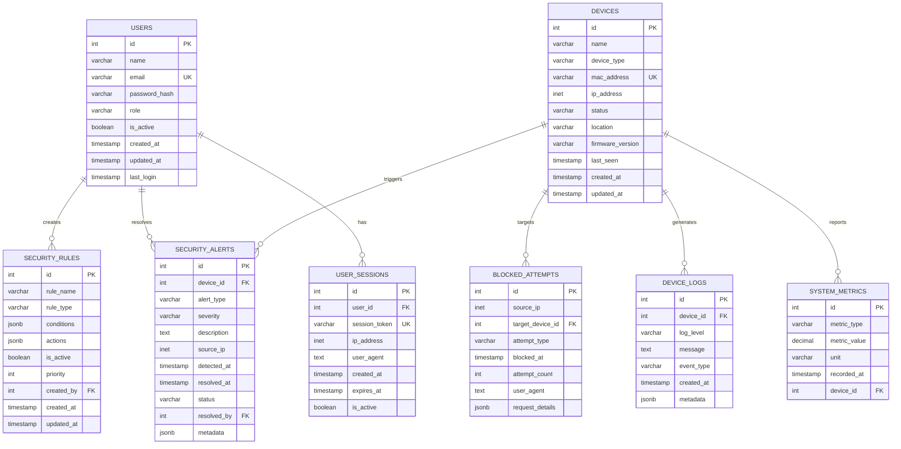

# Entity Relationship Diagram (ERD)

## Overview
This document provides the Entity Relationship Diagram (ERD) for the IoT Intrusion System Dashboard, showing the relationships between different entities in the system.

## ERD Diagram



## Entity Relationships

### Primary Relationships

#### Users Entity Relationships
1. **USERS → SECURITY_RULES** (One-to-Many)
   - Relationship: A user can create multiple security rules
   - Foreign Key: `security_rules.created_by` references `users.id`
   - Cardinality: 1:N (Optional)
   - Business Rule: Security rules may have a creator, but system-generated rules may not

2. **USERS → SECURITY_ALERTS** (One-to-Many)
   - Relationship: A user can resolve multiple security alerts
   - Foreign Key: `security_alerts.resolved_by` references `users.id`
   - Cardinality: 1:N (Optional)
   - Business Rule: Alerts may be resolved by users, but may remain unresolved

3. **USERS → USER_SESSIONS** (One-to-Many)
   - Relationship: A user can have multiple sessions (historical)
   - Foreign Key: `user_sessions.user_id` references `users.id`
   - Cardinality: 1:N (Mandatory for sessions)
   - Business Rule: Each session must belong to a user

#### Devices Entity Relationships
1. **DEVICES → SECURITY_ALERTS** (One-to-Many)
   - Relationship: A device can trigger multiple security alerts
   - Foreign Key: `security_alerts.device_id` references `devices.id`
   - Cardinality: 1:N (Optional)
   - Business Rule: Alerts may be system-wide (not device-specific)

2. **DEVICES → BLOCKED_ATTEMPTS** (One-to-Many)
   - Relationship: A device can be the target of multiple blocked attempts
   - Foreign Key: `blocked_attempts.target_device_id` references `devices.id`
   - Cardinality: 1:N (Optional)
   - Business Rule: Some attempts may target the system generally

3. **DEVICES → DEVICE_LOGS** (One-to-Many)
   - Relationship: A device generates multiple log entries
   - Foreign Key: `device_logs.device_id` references `devices.id`
   - Cardinality: 1:N (Optional)
   - Business Rule: Some logs may be system-wide

4. **DEVICES → SYSTEM_METRICS** (One-to-Many)
   - Relationship: A device reports multiple metrics over time
   - Foreign Key: `system_metrics.device_id` references `devices.id`
   - Cardinality: 1:N (Optional)
   - Business Rule: Some metrics are system-wide (not device-specific)

### Relationship Details

#### Foreign Key Constraints

##### users.id Referenced By:
- `security_rules.created_by` (OPTIONAL)
- `security_alerts.resolved_by` (OPTIONAL)
- `user_sessions.user_id` (MANDATORY)

##### devices.id Referenced By:
- `security_alerts.device_id` (OPTIONAL)
- `blocked_attempts.target_device_id` (OPTIONAL)
- `device_logs.device_id` (OPTIONAL)
- `system_metrics.device_id` (OPTIONAL)

#### Relationship Constraints

1. **Cascade Behavior**:
   - User deletion: SET NULL for optional references, restrict for mandatory
   - Device deletion: SET NULL for optional references
   - No cascading deletes to preserve audit trail

2. **Referential Integrity**:
   - All foreign keys must reference existing records
   - Optional foreign keys can be NULL
   - Mandatory foreign keys cannot be NULL

3. **Business Constraints**:
   - Active users only can create rules and resolve alerts
   - Online devices only can be connection targets
   - Resolved alerts must have a resolved_by user

## Index Strategy

### Primary Indexes (Automatically Created)
- All primary keys have unique indexes
- Unique constraints on email and session_token create indexes

### Secondary Indexes (Performance Optimization)
```sql
-- Device status and activity indexes
CREATE INDEX idx_devices_status ON devices(status);
CREATE INDEX idx_devices_last_seen ON devices(last_seen);

-- Security alert indexes for dashboard queries
CREATE INDEX idx_security_alerts_device_id ON security_alerts(device_id);
CREATE INDEX idx_security_alerts_detected_at ON security_alerts(detected_at);
CREATE INDEX idx_security_alerts_status ON security_alerts(status);

-- Blocked attempts indexes for security analysis
CREATE INDEX idx_blocked_attempts_source_ip ON blocked_attempts(source_ip);
CREATE INDEX idx_blocked_attempts_blocked_at ON blocked_attempts(blocked_at);

-- System metrics indexes for performance monitoring
CREATE INDEX idx_system_metrics_recorded_at ON system_metrics(recorded_at);

-- Device logs indexes for log analysis
CREATE INDEX idx_device_logs_device_id ON device_logs(device_id);
CREATE INDEX idx_device_logs_created_at ON device_logs(created_at);

-- User session indexes for authentication
CREATE INDEX idx_user_sessions_user_id ON user_sessions(user_id);
CREATE INDEX idx_user_sessions_session_token ON user_sessions(session_token);
```

### Composite Indexes (Query Optimization)
```sql
-- Multi-column indexes for common query patterns
CREATE INDEX idx_security_alerts_status_detected ON security_alerts(status, detected_at);
CREATE INDEX idx_blocked_attempts_ip_blocked ON blocked_attempts(source_ip, blocked_at);
CREATE INDEX idx_device_logs_device_created ON device_logs(device_id, created_at);
CREATE INDEX idx_system_metrics_type_recorded ON system_metrics(metric_type, recorded_at);
```

## Data Flow Patterns

### Common Query Patterns

1. **Dashboard Statistics**:
   ```sql
   -- Total devices, active alerts, recent blocked attempts
   SELECT COUNT(*) FROM devices;
   SELECT COUNT(*) FROM security_alerts WHERE status = 'active';
   SELECT COUNT(*) FROM blocked_attempts WHERE blocked_at >= NOW() - INTERVAL '24 hours';
   ```

2. **Security Monitoring**:
   ```sql
   -- Recent alerts with device information
   SELECT sa.*, d.name as device_name 
   FROM security_alerts sa 
   LEFT JOIN devices d ON sa.device_id = d.id 
   WHERE sa.status = 'active' 
   ORDER BY sa.detected_at DESC;
   ```

3. **Device Management**:
   ```sql
   -- Device status with recent activity
   SELECT d.*, dl.created_at as last_activity 
   FROM devices d 
   LEFT JOIN device_logs dl ON d.id = dl.device_id 
   ORDER BY dl.created_at DESC;
   ```

### Data Integrity Considerations

1. **Referential Integrity**: All foreign key relationships are properly enforced
2. **Data Consistency**: Timestamps are consistently managed across entities
3. **Audit Trail**: Historical data is preserved through immutable log entries
4. **Performance**: Indexes are strategically placed for optimal query performance

## Scalability Considerations

### Horizontal Scaling
- Time-based partitioning for logs and metrics tables
- Read replicas for dashboard queries
- Connection pooling for database connections

### Vertical Scaling
- Index optimization for large datasets
- Query optimization for complex joins
- Archival strategies for historical data

### Data Archival Strategy
- Automated archival of old logs and metrics
- Compressed storage for historical data
- Retention policies based on data sensitivity